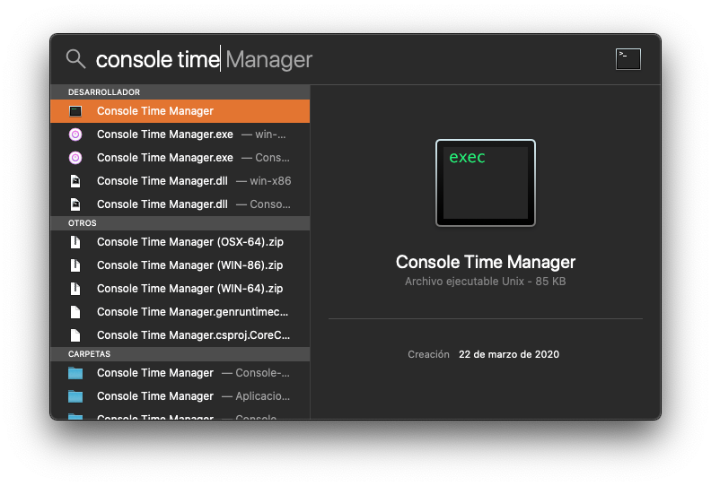
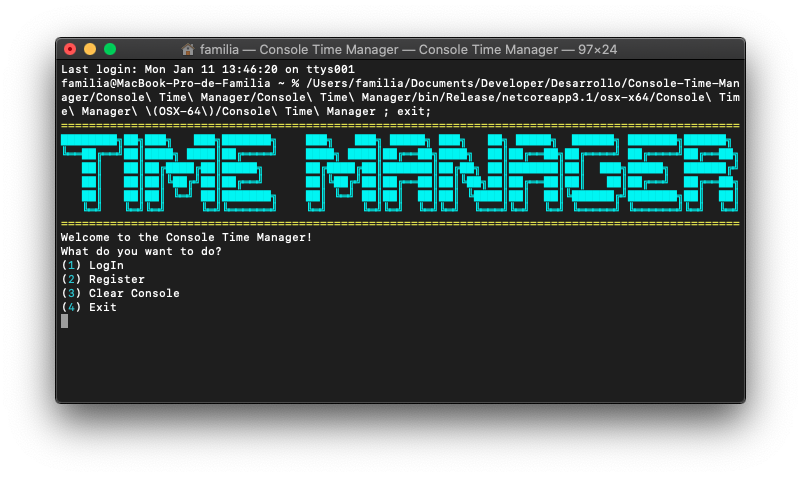
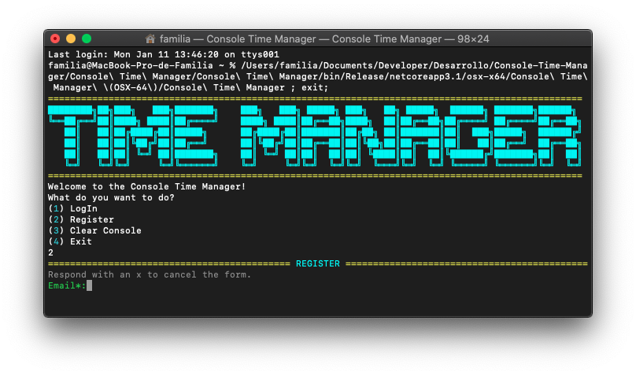
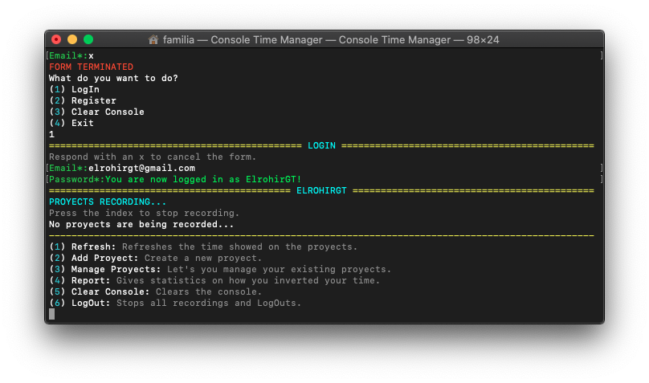
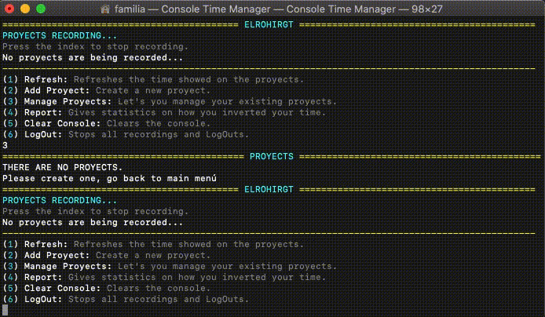

# Console Time Manager
Lets you record in what you invert your time to improve your productivity.
# Download
Download the [corresponding .zip](https://github.com/ElrohirGT/Console-Time-Manager/releases) for your system, unzip it.
If your on Mac copy the folder to Aplications, then pres cmd+space and type "Console Time Manager" (like in the image) then just press enter.

If your on windows you just need to find the .exe inside the folder and double click it, you can create a desktop shortcut if you like.

# Usage
Once started this will pop-up:

All the menus items have a number on the side, press the number that the "Register" item has and then press enter, this should pop up:

You can cancel the form at any time by pressing x, once you have completed all the registration process you'll need to log-in.

***
**NOTE**

Don't forget to log out after recording your time in the application.
***

After successfully loggin in this menu will appear:

The first thing that you'll need to do is create a project, this represents a category of things that you do in your life, you can call it "Work" or "Exercises" if you want, after adding a project you can start recording the time you invest in it. Here's how you do it:

You can stop the recording of a project or sub-tasks at any time by pressing the corresponding key of the project. After stopping a recording you can write a description on what you inverted your time during this project, if you don't want to add one just press enter.
If you want to stop an specific tast then you'll need to write the project index and then the task index, with no spaces in between, **casing is important**.

Here's a brief overview of other things you can do:
- Add and start recording tasks from a project, this let's you divide even more your time, an example could be that you create a task named "Abs" in the project "Execises" for recording the time you spend working abs during your workouts.
- Reports, you can create reports from the day, week, month, year or incluiding all the records in the database, this allows you to get insight on what you are inverting your time, you can even select a specific project that you want to include.
- Delete, Edit, and Add Tasks and projects.
